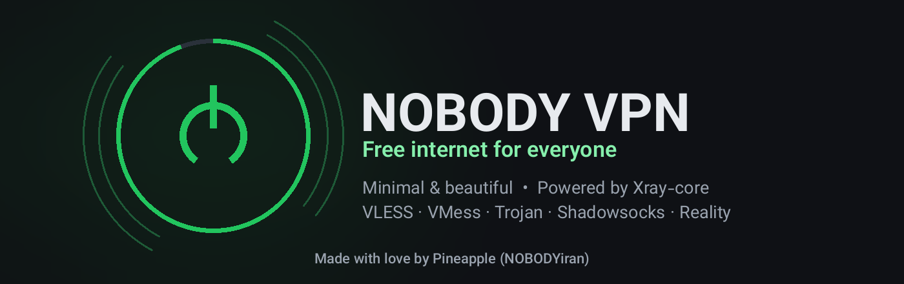

<div align="center">



# NOBODY VPN ⚡

**کلاینت VPN مینیمال، زیبا و قدرتمند برای اندروید — با هسته Xray**

[](https://github.com/MRGhust/NOBODY-VPN/releases/latest)
[](https://github.com/MRGhust/NOBODY-VPN/actions)
[](https://developer.android.com)
[](https://developer.android.com)
[](https://kotlinlang.org)
[](LICENSE)

> **ساخته شده توسط آناناس (NOBODYiran) به امید روزی که نیاز به چنین برنامه هایی نباشد.** 🍍

</div>

---

## 📖 فهرست

- [معرفی](#-معرفی)
- [امکانات](#-امکانات)
- [دانلود](#-دانلود)
- [راهنمای ورود کانفیگ](#-راهنمای-ورود-کانفیگ)
- [ساخت از سورس](#-ساخت-از-سورس)
- [ساختار پروژه](#-ساختار-پروژه)
- [نکات فنی](#%EF%B8%8F-نکات-فنی)
- [سوالات پرتکرار](#-سوالات-پرتکرار)
- [سلب مسئولیت](#%EF%B8%8F-سلب-مسئولیت)
- [مجوز](#-مجوز)

---

## 🌙 معرفی

**NOBODY VPN** یک کلاینت اندرویدی متن‌باز بر پایه هسته [Xray](https://github.com/XTLS/Xray-core) است که با تمرکز بر **مینیمالیسم، زیبایی و سرعت** طراحی شده. رابط کاربری کاملاً با **Jetpack Compose و Material 3** ساخته شده و تمام پروتکل‌های رایج V2ray را به‌صورت کامل پشتیبانی می‌کند — بدون نیاز به روت، بدون تبلیغات، بدون اجازه‌های اضافه.

هسته Xray مستقیماً **داخل همان پروسه اپلیکیشن** اجرا می‌شود و ترافیک کل سیستم از طریق حالت **TUN نیتیو** عبور می‌کند؛ همین یعنی مصرف رم کمتر، اجرای سریع‌تر و معماری ساده‌تر.

## ✨ امکانات

### 🚀 اتصال
- هسته **Xray 26.x** بدون نیاز به root
- حالت **TUN نیتیو** (بدون tun2socks) — ترافیک کل سیستم از داخل هسته عبور می‌کند
- **دکمه اتصال انیمیشنی** با حلقه وضعیت گرادیانی، هاله نور هنگام اتصال و بازخورد لمسی
- نمایش **سرعت لحظه‌ای** آپلود/دانلود، زمان اتصال و **حجم جلسه + حجم کل** (ذخیره دائمی)
- **Tile سریع** در Quick Settings + **اتصال خودکار پس از بوت**
- سازگار با قابلیت **Always-On VPN** سیستم

### 📡 کانفیگ‌ها و اشتراک
- وارد کردن از: **لینک اشتراک** · **کد QR از دوربین** · **QR از گالری** · **کلیپ‌بورد** · ورود دستی · **فایل JSON کامل**
- پروتکل‌ها: `vless://` (شامل **Reality**، Vision، WebSocket، gRPC، H2، XHTTP، SPLICE و…) · `vmess://` · `trojan://` · `ss://` (SIP002 و قدیمی)
- وارد کردن **کانفیگ JSON کامل Xray** با تشخیص خودکار outbound پروکسی
- مدیریت چند **اشتراک** با به‌روزرسانی خودکار (فاصله دلخواه) و User-Agent سفارشی
- **تست تأخیر TCP** (سریع) و **پینگ واقعی** (عبور از تونل) + مرتب‌سازی بر اساس تأخیر/نام
- ویرایش، اشتراک‌گذاری لینک/کانفیگ، نمایش **QR** برای هر سرور، جستجو و فیلتر گروهی

### 🛠 تنظیمات پیشرفته
- **DNS سفارشی**: DoH/UDP (Google، Cloudflare، Quad9، AdGuard، Shecan…) + استراتژی کوئری
- **مسیریابی**: پروکسی همه‌چیز / **دور زدن سایت‌های ایرانی** / قوانین سفارشی (مستقیم/پروکسی/مسدود)
- مسدودسازی **تبلیغات** و **UDP**
- **تقسیم برنامه‌ها (Split Tunneling)**: «فقط انتخابی‌ها» یا «همه به‌جز انتخابی‌ها»
- MTU، DNS رابط VPN، دور زدن LAN، IPv6
- تم سیستم/روشن/تیره، رنگ‌های پویا، **دو زبانه (فارسی/English)** — همه با طراحی متریال
- **لاگ زنده هسته** با سطح قابل تنظیم و قابلیت کپی

## 📥 دانلود

جدیدترین نسخه را از بخش [**Releases**](https://github.com/MRGhust/NOBODY-VPN/releases) دریافت کنید:

| فایل | مناسب برای |
|---|---|
| `NOBODY-VPN-…-arm64.apk` | اکثر گوشی‌های مدرن (پیشنهادی — حجیم‌تر نیست) |
| `NOBODY-VPN-…-universal.apk` | همه معماری‌ها (arm64، armeabi، x86_64 و…) |

> امضای دیجیتال نسخه‌های رسمی یکسان است؛ برای به‌روزرسانی، کافیست APK جدید را نصب کنید.

## 📋 راهنمای ورود کانفیگ

1. لینک کانفیگ را کپی کنید (یا QR را اسکن کنید)
2. در تب **سرورها** از منوی `⋮` گزینه **«از کلیپ‌بورد»** را بزنید — یا دکمه چسب را در «افزودن دستی»
3. سرور را انتخاب و از صفحه اصلی متصل شوید

لینک اشتراک (Subscription) هم دقیقاً به همین شکل وارد می‌شود و همه سرورهای آن به‌صورت خودکار دسته‌بندی و به‌روزرسانی می‌شوند.

## 🧱 ساخت از سورس

پیش‌نیاز: **JDK 17+** — بقیه (Android SDK) به‌صورت خودکار دانلود می‌شود.

```bash
git clone https://github.com/MRGhust/NOBODY-VPN.git
cd NOBODY-VPN

# تست + ساخت (امضای خودکار debug)
./gradlew test assembleDebug

# ساخت release امضاشده: فایل app/nobodyvpn.keystore خودتان را قرار دهید
./gradlew assembleRelease \
    -PNB_STORE_PASSWORD=yourStorePass -PNB_KEY_ALIAS=yourAlias -PNB_KEY_PASSWORD=yourKeyPass

# فقط معماری arm64 (خروجی سبک‌تر)
./gradlew assembleRelease -Pabi=arm64-v8a
```

- خروجی: `app/build/outputs/apk/…`
- **keystore به‌صورت عمدی در مخزن قرار ندارد** — نسخه‌های رسمی با کلید خصوصی ما امضا می‌شوند؛ اگر با کلید خودتان بسازید، برای نصب باید نسخه رسمی را حذف کنید.
- فایل‌های حجیم (`app/libs/libv2ray.aar` و `assets/geoip*.dat`) داخل مخزن هستند تا بیلد بدون دانلود اضافه انجام شود.

## 📁 ساختار پروژه

```
app/src/main/java/com/nobodyiran/nobodyvpn/
├── core/       # ConfigBuilder (تولید کانفیگ Xray) + XrayCore (پوشش هسته gomobile)
├── data/       # مدل‌ها + Repo (DataStore)
├── parser/     # ShareLink / JsonConfig / SubParser (تجزیه لینک و اشتراک)
├── net/        # SubUpdater + DelayTester (پینگ TCP و واقعی)
├── service/    # VpnService + نوتیفیکیشن + Tile + BootReceiver
├── ui/         # Compose (خانه، سرورها، تنظیمات، لاگ، اسکنر QR)
└── util/       # ثابت‌ها و ابزارها
app/libs/libv2ray.aar          # هسته Xray (gomobile bindings)
app/src/main/assets/           # geoip.dat / geosite.dat
```

## ⚙️ نکات فنی

- minSdk **29** (اندروید ۱۰) · targetSdk **37** · Kotlin **2.4** + AGP **9.3** + Gradle **9.5**
- جریان ترافیک: `TUN (fd از VpnService) → inbound tun هسته → outbound پروکسی`
- جلوگیری از حلقه مسیر با مستثنا کردن UID خود اپ (`addDisallowedApplication`)
- آمار ترافیک از `queryAllOutboundTrafficStats` و پینگ واقعی از `measureOutboundDelay`
- فایل‌های geo در اولین اجرا به `filesDir` کپی می‌شوند

## ❓ سوالات پرتکرار

<details>
<summary><b>چرا دفعه اول پیام تأیید VPN می‌آید؟</b></summary>
اندروید برای هر اپ VPN فقط یک‌بار اجازه می‌گیرد. روی «تأیید/OK» بزنید؛ دفعات بعد مستقیم وصل می‌شود.
</details>

<details>
<summary><b>تفاوت پینگ TCP و پینگ واقعی؟</b></summary>
پینگ TCP فقط زمان رسیدن به سرور را می‌سنجد (سریع). پینگ واقعی یک درخواست HTTPS کامل از داخل تونل می‌فرستد (دقیق‌تر؛ نشان‌دهنده سلامت کل مسیر است).
</details>

<details>
<summary><b>حالت TUN چیست و آیا روت لازم دارد؟</b></summary>
نه. از VpnService رسمی اندروید استفاده می‌شود؛ fd تونل مستقیماً به هسته Xray داده می‌شود و بدون روت کل ترافیک مدیریت می‌شود.
</details>

<details>
<summary><b>داده من کجا ذخیره می‌شود؟</b></summary>
همه‌چیز محلی است: فقط در DataStore خود اپ روی دستگاه شما. هیچ سرور، آنالیتیکس یا تلمتری وجود ندارد — سورس کاملاً قابل بررسی است.
</details>

## ⚠️ سلب مسئولیت

این پروژه صرفاً یک **کلاینت** متن‌باز است و هیچ سرور یا سرویسی ارائه نمی‌دهد. استفاده از آن مسئولیت کاملاً بر عهده کاربر و مطابق قوانین محل سکونت اوست. سازنده هیچ مسئولیتی در قبال سوءاستفاده ندارد.

## 📄 مجوز

کد تحت مجوز [MIT](LICENSE) منتشر شده است. هسته [Xray-core](https://github.com/XTLS/Xray-core) تحت MPL 2.0 و [AndroidLibXrayLite](https://github.com/2dust/AndroidLibXrayLite) تحت مجوز پروژه خود است.

---

<div align="center">

**⭐ اگر این پروژه برایتان مفید بود، با یک ستار حمایت کنید**

**⭐ If this project helped you, please give it a star**

</div>

---

<div align="center">

<details>
<summary><b>🌍 English</b></summary>

<br/>

**NOBODY VPN** is a minimal, beautiful open-source Android VPN client powered by the **Xray core**, built entirely with **Jetpack Compose + Material 3**. The core runs in-process with **native TUN** mode (no root, no tun2socks), keeping the architecture simple and memory usage low.

**Highlights:** VLESS (Reality / XHTTP / gRPC / WS), VMess, Trojan, Shadowsocks · subscription links with auto-update · QR import (camera & gallery) and clipboard paste · split tunneling · custom DNS (DoH) & routing (bypass-Iran presets) · live speed & traffic stats · Quick-Settings tile · boot auto-connect · core log viewer · Persian & English UI.

**Download** the latest APK from [Releases](https://github.com/MRGhust/NOBODY-VPN/releases). Build from source with `./gradlew assembleDebug` (see instructions above).

This is purely a client — no servers are provided. Use in accordance with your local laws.

</details>

</div>
